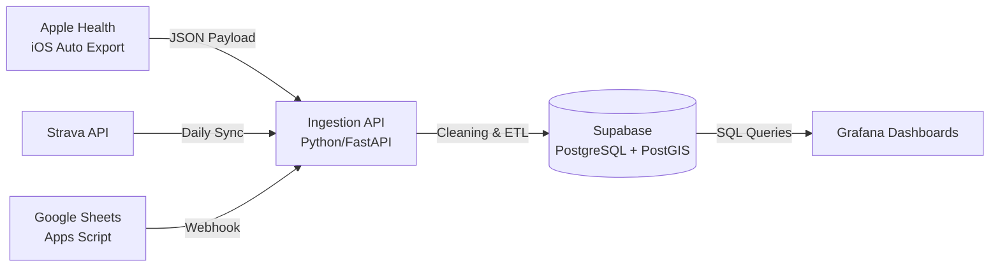

# Runlytics: Personal Data Warehouse & Analytics Engine

**A centralized, automated cloud infrastructure for aggregating and analyzing personal biometric, training, and geospatial data.**

> **Note:** This is a personal portfolio project demonstrating end-to-end data engineering, API integration, and cloud architecture. It is designed as a live production system for a single user, not as an open-source library.

## Project Objective
Commercial fitness platforms (Strava, Apple Health) fragment data into silos. **Runlytics** solves this by engineering a private Data Warehouse that unifies these streams, enabling custom correlation analysis (e.g., *How does sleep quality impact marathon pace?*) and geospatial visualization without relying on third-party "black box" algorithms.

## System Architecture
The system operates as a "Zero-Touch" ETL pipeline. Data is harvested automatically via webhooks and scheduled cron jobs, processed in a Python backend, and stored in a normalized PostgreSQL schema.

## ⚙️Engineering Highlights

### 1. Automated ETL Pipeline
* **Challenge:** Integrating disparate data sources (JSON payloads, REST APIs, Manual Logs) into a unified schema.
* **Solution:** Built a Python-based middleware hosted on **Render**. It acts as a central listener, validating incoming webhooks and normalizing data types before database insertion.

### 2. Geospatial Data Handling
* **Challenge:** Storing and visualizing complex run routes without bloating the database.
* **Solution:** Implemented **PostGIS** extensions to decode Google Polyline strings into lightweight GeoJSON/WKT formats, allowing for efficient storage and queryable map layers in Grafana.

### 3. Production Database Design
* **Challenge:** Querying time-series biometric data alongside relational training logs.
* **Solution:** Designed a **PostgreSQL** schema on Supabase with dedicated tables for `biometrics`, `runs`, and `journal` entries, linked by timestamp keys to support complex SQL joins and window functions.

## Tech Stack

* **Core:** Python 3.10+
* **Database:** PostgreSQL 15, PostGIS (Supabase)
* **Cloud Infrastructure:** Render (Web Service), AWS EC2 (Dev Environment)
* **Visualization:** Grafana Cloud (Geomaps, Time-series)
* **Integrations:** Strava API, Apple Health, Google Sheets API

## Visualization

The data feeds into a "Mission Control" Grafana dashboard that monitors:
* **Training Volume:** Weekly mileage aggregation via SQL Window Functions.
* **Recovery Metrics:** Rolling average of HRV vs. Resting Heart Rate.
* **Geospatial History:** Route plotting using decoded Polyline data.

## Future Roadmap

Runlytics is an active project. The next phase of development focuses on moving from *descriptive* analytics to *predictive* modeling.

* **Predictive Recovery Model:** Implementing a Scikit-Learn/XGBoost model to predict tomorrow's "Readiness Score" based on rolling 7-day training load and sleep variance.
* **Natural Language Querying (RAG):** Integrating an LLM interface to allow natural language questions over the Journal dataset (e.g., *"Show me runs where I reported knee pain in the last 6 months"*).
* **Anomaly Detection:** Automated alerting for significant deviations in Resting Heart Rate or data drift in sensor inputs.
* **Computer Vision Module (Gait Analysis):** Developing a pipeline using **OpenCV** and **MediaPipe** to perform pose estimation on run videos. The goal is to extract biomechanical features (vertical oscillation, stride length) and correlate them with injury risk.
